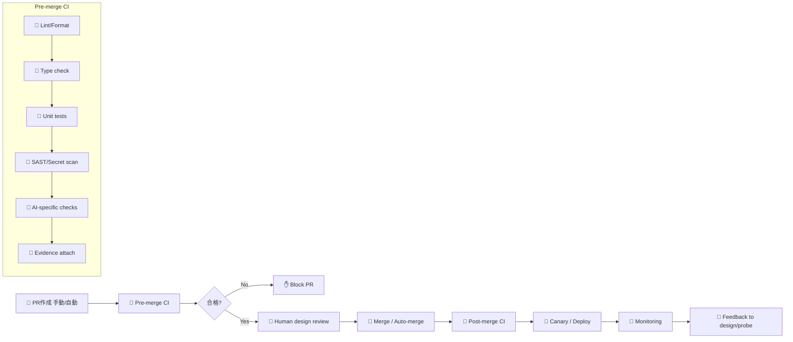

# CI/CDワークフロー と チェックスクリプト実装ガイド

## 目的

AI生成コードを安全にCI/CDに組み込むための実践的なサンプル集。以下を提供します：

- GitHub Actions ワークフロー（Pre-merge / Post-merge / Model-update 自動再評価）
- チェックスクリプト（静的解析、型チェック、AI固有チェック、差分評価）
- 導入手順と運用メモ

---

## 目次

1. [全体フロー](#全体フロー)
2. [Pre-merge ワークフロー](#pre-mergeワークフロー)
3. [Post-merge & Canary ワークフロー](#post-mergecanaryワークフロー)
4. [モデル更新時の自動再評価](#モデル更新時の自動再評価)
5. [チェックスクリプト実装](#チェックスクリプト実装)
6. [導入手順](#導入手順)
7. [運用上の注意と推奨閾値](#運用上の注意と推奨閾値)

---

## 全体フロー



---

## Pre-merge ワークフロー

### ファイル位置：`.github/workflows/pre-merge.yml`

```yaml
name: Pre-merge Quality Gates

on:
  pull_request:
    types: [opened, synchronize, reopened]

jobs:
  pre-merge:
    runs-on: ubuntu-latest
    steps:
      - name: Checkout
        uses: actions/checkout@v4

      - name: Setup Python
        uses: actions/setup-python@v4
        with:
          python-version: '3.11'

      - name: Install dependencies
        run: |
          python -m pip install --upgrade pip
          pip install -r ci/requirements.txt

      - name: Lint and Format
        run: ./ci/lint_and_type.sh

      - name: Unit tests
        run: ./ci/run_unit_tests.sh

      - name: Security scan (SAST / Secret)
        run: |
          # Example: run semgrep or trivy
          semgrep --config auto .

      - name: AI-specific checks
        env:
          MODEL_ID: ${{ secrets.AI_MODEL_ID }}
          API_KEY: ${{ secrets.AI_API_KEY }}
        run: |
          python ci/ai_checks.py \
            --pr-number ${{ github.event.number }} \
            --repo ${{ github.repository }}

      - name: Attach evidence to PR
        run: |
          python ci/attach_evidence_to_pr.py \
            --pr ${{ github.event.number }}
```

### ポイント

- `ci/requirements.txt` に必要ライブラリ（semgrep, astor, requests等）を記載
- `ai_checks.py` は AI出力の安定性・禁止表現・差分スコアを算出し、PRコメントとして添付
- 各ステップの失敗でPRをブロック

---

## Post-merge & Canary ワークフロー

### ファイル位置：`.github/workflows/post-merge.yml`

```yaml
name: Post-merge Integration & Canary

on:
  push:
    branches: [ main ]

jobs:
  integration:
    runs-on: ubuntu-latest
    steps:
      - uses: actions/checkout@v4

      - name: Setup
        uses: actions/setup-python@v4
        with:
          python-version: '3.11'

      - name: Run integration tests
        run: |
          ./ci/run_integration_tests.sh

      - name: Deploy Canary
        run: |
          ./ci/deploy_canary.sh

      - name: Monitor Canary (short smoke)
        run: |
          ./ci/smoke_check.sh
```

### ポイント

- Canaryデプロイ後に自動で短時間の監視（エラー率・レイテンシ）を実行
- 閾値超過で自動ロールバックをトリガ

---

## モデル更新時の自動再評価

### ファイル位置：`.github/workflows/model-update-re-eval.yml`

```yaml
name: Model Update Re-evaluation

on:
  workflow_dispatch:
  repository_dispatch:
    types: [model_update]

jobs:
  re-evaluate:
    runs-on: ubuntu-latest
    steps:
      - uses: actions/checkout@v4

      - name: Setup Python
        uses: actions/setup-python@v4
        with:
          python-version: '3.11'

      - name: Fetch list of approved PRs
        run: |
          python ci/fetch_approved_prs.py --output approved_prs.json

      - name: Re-evaluate PRs
        env:
          MODEL_ID: ${{ secrets.NEW_MODEL_ID }}
          API_KEY: ${{ secrets.AI_API_KEY }}
        run: |
          python ci/re_evaluate_prs.py \
            --input approved_prs.json \
            --model ${{ secrets.NEW_MODEL_ID }}
```

### ポイント

- モデル更新を検知したら既承認変更を自動再評価
- 差分閾値超過のPRは自動でDraft化し、担当者に通知

---

## チェックスクリプト実装

### ディレクトリ構成

```
ci/
├── requirements.txt
├── lint_and_type.sh
├── run_unit_tests.sh
├── run_integration_tests.sh
├── deploy_canary.sh
├── smoke_check.sh
├── ai_checks.py
├── ast_diff.py
├── prohibited_scan.py
├── similarity_check.py
├── fetch_approved_prs.py
├── re_evaluate_prs.py
└── attach_evidence_to_pr.py
```

---

### 1. `ci/lint_and_type.sh`

```bash
#!/usr/bin/env bash
set -euo pipefail

echo "=== Lint (ESLint / flake8) ==="

# TypeScript example
if [ -f package.json ]; then
  npm ci
  npm run lint || { echo "Lint failed"; exit 1; }
fi

# Python example
if [ -f pyproject.toml ] || [ -f requirements.txt ]; then
  pip install -r ci/requirements.txt
  flake8 . || { echo "flake8 failed"; exit 1; }
  mypy . || { echo "mypy failed"; exit 1; }
fi

echo "✅ Lint and type checks passed"
```

---

### 2. `ci/run_unit_tests.sh`

```bash
#!/usr/bin/env bash
set -euo pipefail

echo "=== Run unit tests ==="

# Node
if [ -f package.json ]; then
  npm test --silent
fi

# Python
if [ -f pytest.ini ] || [ -d tests ]; then
  pytest -q --maxfail=1 --disable-warnings
fi

# Collect coverage
if command -v coverage >/dev/null 2>&1; then
  coverage run -m pytest
  coverage report --fail-under=70
fi

echo "✅ Unit tests passed"
```

---

### 3. `ci/ai_checks.py`

AI固有チェックの統合スクリプト：
- 同一プロンプトで複数回生成してAST差分を算出
- 禁止表現検査
- 類似度チェック
- 結果をPRコメント or アーティファクトとして出力

```python
#!/usr/bin/env python3
import argparse
import json
import os
import subprocess
from pathlib import Path

def call_model(prompt: str, model_id: str, api_key: str) -> str:
    """
    モデル呼び出しのラッパー（実装は環境依存）
    実際のAPI呼び出しをここに実装してください
    """
    # TODO: 実際のAPI呼び出しを実装
    return f"# GENERATED CODE\n{prompt}"

def generate_multiple(prompt: str, n: int, model_id: str, api_key: str):
    """複数回生成"""
    outputs = []
    for i in range(n):
        out = call_model(prompt, model_id, api_key)
        outputs.append(out)
    return outputs

def save_artifact(name: str, content: str):
    """アーティファクト保存"""
    Path("artifacts").mkdir(exist_ok=True)
    with open(Path("artifacts") / name, "w") as f:
        f.write(content)

def main():
    parser = argparse.ArgumentParser()
    parser.add_argument("--pr-number", required=True)
    parser.add_argument("--repo", required=True)
    parser.add_argument("--model", default=os.environ.get("MODEL_ID"))
    args = parser.parse_args()

    # 1) プロンプトを取得（PRに添付されている想定）
    prompt_path = Path("ci/prompt.txt")
    if not prompt_path.exists():
        print("⚠️ No prompt file found at ci/prompt.txt")
        return
    prompt = prompt_path.read_text()

    # 2) 複数回生成
    outputs = generate_multiple(
        prompt, n=3, 
        model_id=args.model, 
        api_key=os.environ.get("API_KEY")
    )

    # 3) アーティファクト保存
    for idx, out in enumerate(outputs):
        save_artifact(f"generated_{idx}.txt", out)

    # 4) AST 差分算出
    subprocess.run([
        "python", "ci/ast_diff.py",
        "artifacts/generated_0.txt",
        "artifacts/generated_1.txt",
        "artifacts/generated_2.txt"
    ], check=True)

    # 5) 禁止表現検査
    subprocess.run([
        "python", "ci/prohibited_scan.py",
        "artifacts/generated_0.txt"
    ], check=True)

    # 6) 類似度チェック
    subprocess.run([
        "python", "ci/similarity_check.py",
        "artifacts/generated_0.txt"
    ], check=True)

    # 7) 証跡出力
    save_artifact("ai_check_summary.json", json.dumps({
        "model": args.model,
        "generated_count": len(outputs),
        "pr": args.pr_number,
        "status": "passed"
    }, indent=2))

    print("✅ AI checks completed")

if __name__ == "__main__":
    main()
```

---

### 4. `ci/ast_diff.py`

AST差分を算出してスコアリング：

```python
#!/usr/bin/env python3
import ast
import sys
from pathlib import Path
import json

def ast_nodes(source: str):
    """AST から ノード型を抽出"""
    try:
        tree = ast.parse(source)
        nodes = []
        for node in ast.walk(tree):
            nodes.append(type(node).__name__)
        return nodes
    except SyntaxError:
        return []

def jaccard(a, b):
    """Jaccard 係数（類似度指標）"""
    sa, sb = set(a), set(b)
    inter = sa & sb
    uni = sa | sb
    if not uni:
        return 1.0
    return len(inter) / len(uni)

def main():
    files = sys.argv[1:]
    if len(files) < 2:
        print("Usage: ast_diff.py file1 file2 [file3 ...]")
        sys.exit(1)

    node_sets = []
    for f in files:
        src = Path(f).read_text()
        nodes = ast_nodes(src)
        node_sets.append(nodes)

    # pairwise jaccard vs base
    base = node_sets[0]
    diffs = []
    for i in range(1, len(node_sets)):
        score = jaccard(base, node_sets[i])
        diffs.append(score)

    summary = {
        "files": files,
        "jaccard_scores_vs_base": diffs,
        "mean_score": sum(diffs) / len(diffs) if diffs else 1.0,
        "status": "pass" if all(s > 0.95 for s in diffs) else "warn"
    }

    Path("artifacts/ast_diff_summary.json").write_text(json.dumps(summary, indent=2))
    print(json.dumps(summary, indent=2))

if __name__ == "__main__":
    main()
```

---

### 5. `ci/prohibited_scan.py`

禁止パターンを検出：

```python
#!/usr/bin/env python3
import re
import sys
from pathlib import Path
import json

PROHIBITED_PATTERNS = [
    (r"eval\(", "eval is prohibited"),
    (r"exec\(", "exec is prohibited"),
    (r"subprocess\.Popen", "subprocess.Popen is prohibited"),
    (r"aws_access_key_id", "AWS credentials found"),
    (r"password\s*=\s*['\"]", "Password hardcoded"),
]

def scan_file(path: str):
    """ファイルをスキャン"""
    text = Path(path).read_text()
    findings = []
    for pattern, description in PROHIBITED_PATTERNS:
        if re.search(pattern, text):
            findings.append({"pattern": pattern, "description": description})
    return findings

def main():
    if len(sys.argv) < 2:
        print("Usage: prohibited_scan.py <file>")
        sys.exit(1)

    path = sys.argv[1]
    findings = scan_file(path)

    summary = {
        "file": path,
        "findings": findings,
        "status": "pass" if not findings else "fail"
    }

    Path("artifacts/prohibited_scan.json").write_text(json.dumps(summary, indent=2))
    print(json.dumps(summary, indent=2))

    if findings:
        print(f"❌ Prohibited patterns found: {len(findings)}")
        sys.exit(2)
    
    print("✅ No prohibited patterns found")
    sys.exit(0)

if __name__ == "__main__":
    main()
```

---

### 6. `ci/similarity_check.py`

類似度チェック（社内外コードベースとの比較）：

```python
#!/usr/bin/env python3
import sys
import json
from pathlib import Path
from difflib import SequenceMatcher

def compute_similarity(text: str, corpus_texts: list) -> float:
    """CorpusとのSimilarity を計算"""
    max_sim = 0.0
    for corpus in corpus_texts:
        sm = SequenceMatcher(None, text, corpus)
        ratio = sm.ratio()
        max_sim = max(max_sim, ratio)
    return max_sim

def main():
    if len(sys.argv) < 2:
        print("Usage: similarity_check.py <file>")
        sys.exit(1)

    file = sys.argv[1]
    text = Path(file).read_text()

    # 社内コードベースから比較対象をロード
    corpus = []
    for p in Path("src").rglob("*.py"):
        corpus.append(p.read_text())

    score = compute_similarity(text, corpus)

    summary = {
        "file": file,
        "similarity_score": score,
        "status": "pass" if score < 0.8 else "warn"
    }

    Path("artifacts/similarity_check.json").write_text(json.dumps(summary, indent=2))
    print(json.dumps(summary, indent=2))

    if score > 0.8:
        print(f"⚠️ High similarity detected ({score:.2%}) -> escalate to legal")
        sys.exit(3)

    print(f"✅ Similarity OK ({score:.2%})")
    sys.exit(0)

if __name__ == "__main__":
    main()
```

---

## 導入手順

### ステップ 1：基盤の構築（1～2日）

1. `ci/` ディレクトリをリポジトリに作成
2. `.github/workflows/pre-merge.yml` を追加
3. `ci/lint_and_type.sh` と `ci/run_unit_tests.sh` を配置し、実行権限を付与

```bash
chmod +x ci/*.sh
```

4. `ci/requirements.txt` に必要パッケージを記載：

```txt
semgrep>=1.0
flake8>=5.0
mypy>=1.0
pytest>=7.0
requests>=2.28
astor>=0.8
```

### ステップ 2：AI固有チェックの追加（1週間）

1. `ci/ai_checks.py`, `ci/ast_diff.py`, `ci/prohibited_scan.py`, `ci/similarity_check.py` を配置
2. 環境変数に`AI_API_KEY`, `AI_MODEL_ID` を登録
3. PRテンプレートに以下を追加：

```markdown
## AI生成情報
- [ ] 使用プロンプト：[ここに記載]
- [ ] モデルID：[ここに記載]
- [ ] 生成回数：[ここに記載]
```

### ステップ 3：Post-merge & Canary の有効化（2週間）

1. `.github/workflows/post-merge.yml` を追加
2. `ci/run_integration_tests.sh`, `ci/deploy_canary.sh`, `ci/smoke_check.sh` を実装
3. Canaryデプロイのモニタリング指標を定義

### ステップ 4：モデル更新自動再評価（1ヶ月）

1. `.github/workflows/model-update-re-eval.yml` を追加
2. `ci/fetch_approved_prs.py`, `ci/re_evaluate_prs.py` を実装
3. 運用手順書を作成

---

## 運用上の注意と推奨閾値

### 閾値設定ガイド

| 指標 | 推奨値 | 説明 |
|------|--------|------|
| **AST 差分（Jaccard係数）** | > 0.95 | 生成の安定性。低いと人間レビュー必須。 |
| **カバレッジ** | ≥ 70% | 最小基準。重要ロジックはより高く。 |
| **テストフレーク率** | < 2% | テストの信頼性。超過時は該当テストを調査。 |
| **類似度スコア** | < 0.8 | 社内外コードとの類似度。超過時は法務確認。 |
| **モデル更新再評価頻度** | マイナー/メジャー更新時 | 自動再評価でカバレッジ低下を検出。 |

### 運用のポイント

1. **段階的な自動化**
   - 初期：Draft PR → 手動承認
   - 中期：Draft PR → 限定自動化（特定モジュール）
   - 長期：フル自動マージ（要件により）

2. **AI呼び出しの実装**
   - 認証・レート制限・タイムアウト処理を含める
   - すべての呼び出しをログに記録
   - コスト監視を設定

3. **テスト生成の信頼性**
   - AIが生成したテストのフレーク率を常に測定
   - 信頼できないテストは手動で再実装
   - テスト品質指標をダッシュボード化

4. **失敗時の対応**
   - CI失敗時は自動で Draft 化して人間に通知
   - エスカレーション要件を明確に定義
   - RCA（根本原因分析）ログを記録

### 監視アラート設定例

```yaml
# Prometheus/Grafana での例
alerts:
  - name: "AST差分が閾値超過"
    condition: "ast_diff < 0.95"
    action: "notify_dev_team"
  
  - name: "テストカバレッジ低下"
    condition: "coverage < 70%"
    action: "block_merge"
  
  - name: "禁止表現検出"
    condition: "prohibited_findings > 0"
    action: "immediate_escalation"
```

---

## 実行プラン（推奨順序）

### 短期（1～2週間）
- [x] Pre-merge ワークフロー導入
- [x] Lint・Type チェック有効化
- [x] Unit テスト必須化

### 中期（1～3ヶ月）
- [ ] AI固有チェック有効化（段階的）
- [ ] AST差分・禁止表現検査統合
- [ ] PR証跡テンプレ運用開始

### 長期（3ヶ月～）
- [ ] モデル更新自動再評価確立
- [ ] 自動マージ条件拡張
- [ ] 継続的な閾値最適化

---

## トラブルシューティング

### よくある問題

| 問題 | 原因 | 解決方法 |
|------|------|---------|
| `ai_checks.py` がタイムアウト | API呼び出しが遅い | タイムアウト値を拡張 or 非同期処理化 |
| テストフレーク率が高い | AI生成テストの品質 | 生成テストを手動レビュー、条件を厳化 |
| 類似度スコアが頻繁に超過 | 類似コードが多い | 閾値を調整 or パターンマッチングを改善 |
| Canary ロールバックが頻発 | デプロイ前チェック不足 | Pre-merge ゲートを厳化 |

---

## まとめ

このガイドを使用して、以下の順序で導入してください：

1. **Pre-merge ワークフロー** から始める
2. **AI固有チェック** を段階的に追加
3. **自動再評価** で継続的な品質向上を実現

質問や改善案は Issue で報告してください。
