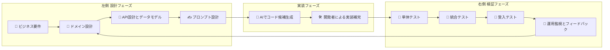
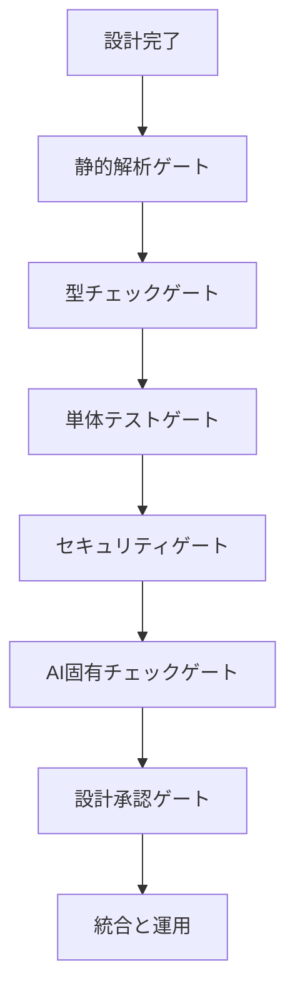
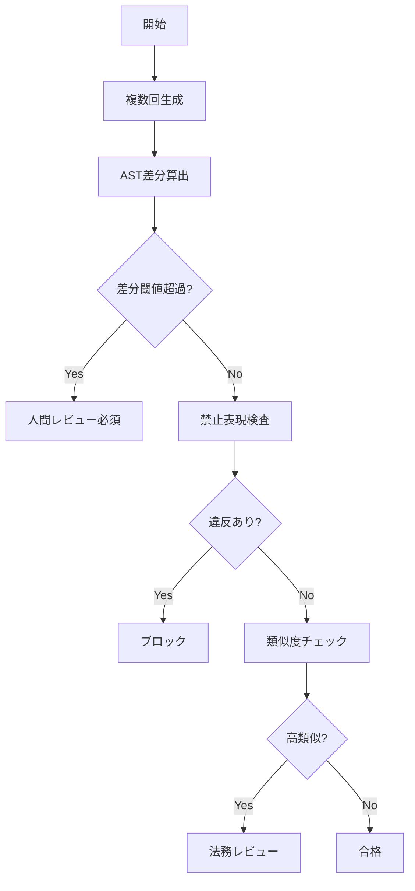
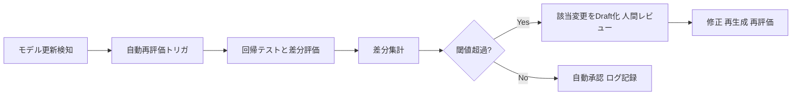

# AIと人間の分担と品質担保ワークフロー

## 目的

AI生成が組み込まれたアジャイル開発で、V字検証思想を回しながら以下を明確にする：
- **何をインプットにし**
- **どのようなアウトプットを作り**
- **何をレビューしてどう判断するか**

証跡と再評価ループを前提にした実務テンプレを一つのドキュメントにまとめる。

---

## 全体フロー：V字をアジャイルで回す



---

## 人とAIの明確な分担表

| 領域 | AIが担うこと | 人が担うこと |
|------|-----------|-----------|
| **要件探索** | 要件からの代替案やユースケース候補を生成 | ビジネス価値判断と受入基準の確定 |
| **ドメイン設計** | ドメインモデル案や用語集の草案を提示 | 境界設計と責務決定 |
| **API設計** | API案やスキーマ草案を生成 | 非機能要件とエラー設計の確定 |
| **実装** | ボイラープレート、CRUD、変換ロジックの下書き | コアアルゴリズム、最適化、セキュリティ実装 |
| **テスト** | 単体テスト候補、モック、テストデータ生成 | テスト観点設計、境界値、探索的テスト |
| **品質検査** | 静的解析補助、初期指摘、差分評価 | 設計レビュー、最終承認、判断責任 |
| **CI/CD** | 自動PR作成、差分評価の自動化 | 品質ゲート設計、Auto-mergeポリシー、ロールバック |
| **運用** | ログ要約、異常候補抽出 | インシデント対応、根本原因分析、対策決定 |

---

## フェーズ別：入力・出力・レビュー項目表

| 工程 | インプット | アウトプット | レビューで見ること |
|------|-----------|-----------|-----------------|
| **要件定義** | ビジネスゴール<br/>ステークホルダー期待 | 要件一覧<br/>受入基準 | 受入基準が具体的か<br/>非機能が定義されているか |
| **ドメイン設計** | 要件<br/>既存システム | ドメインモデル<br/>用語集 | 境界と責務が明確か<br/>一貫性があるか |
| **API設計とデータモデル** | ドメインモデル<br/>非機能要件 | API仕様<br/>スキーマ | エラー設計と性能目標があるか |
| **プロンプト設計** | API仕様<br/>テスト観点 | プロンプトテンプレ<br/>禁止事項 | 再現性と禁止事項が網羅されているか |
| **AI生成コード候補** | プロンプトテンプレ | 候補コード群<br/>生成証跡 | 出力安定性と禁止表現の有無 |
| **実装補完** | 候補コード<br/>開発者知見 | 実装コード<br/>単体テスト | 設計準拠とセキュリティが担保されているか |
| **単体テスト** | 実装コード<br/>テストケース | テスト結果<br/>カバレッジ | 境界・異常系が網羅されているか |
| **統合テスト** | 結合環境<br/>モック | 統合結果<br/>性能指標 | API契約遵守とレイテンシが許容内か |
| **受入テスト** | ステークホルダー期待 | 受入判定 | 受入基準に合致しているか |
| **運用監視** | 本番ログ<br/>メトリクス | アラート<br/>RCA候補 | 異常検知精度と対応速度が担保されているか |

---

## 品質ゲート：V字ポイントと合格条件



### 各ゲートの合格条件

- **静的解析ゲート**：重大なLint違反なし
- **型チェックゲート**：型整合性が取れていること
- **単体テストゲート**：自動テスト合格とカバレッジ基準達成
- **セキュリティゲート**：秘密情報や危険呼び出しがないこと
- **AI固有チェックゲート**：出力安定性と禁止表現のクリア、類似度問題なし
- **設計承認ゲート**：設計責任者の承認があること

---

## AI固有チェック：抽象フローと要件



### 要件ポイント

- **出力安定性**：同一プロンプトを N 回生成し AST 差分で評価。閾値超過は人間レビュー。
- **禁止表現検査**：秘密、ハードコード、外部アクセス、eval を検出してブロック。
- **類似度チェック**：社内外コードとの高類似は法務確認。
- **証跡**：プロンプト、モデルID、生成回数、差分スコアをPRに添付。

---

## モデル更新時の再評価ループ



### 運用ルール

- モデル更新は既承認変更を自動で再評価する
- 差分はテスト失敗数、AST差分、セキュリティ警告でスコア化
- 閾値超過は自動で Draft 化し人間の再承認を要求

---

## 工程別テンプレート（実務用）

### 要件テンプレート

```markdown
# 要件 [タイトル]

## 背景
- ビジネスの文脈と目的

## ビジネスゴール
- KPI / 定量目標

## ステークホルダー
- プロダクトオーナー

## 受入基準
- 条件1
- 条件2

## 非機能要件
- 性能：RPS、P95
- 可用性：SLA
- セキュリティ：認可方式

## 優先度・期限
- 優先度
- 期限

## 依存関係
- 他サービス、外部API
```

### ドメイン設計テンプレート

```markdown
# ドメイン設計 [名称]

## 主要エンティティ
- EntityA（属性、所有DB）

## 関係図
- EntityA 1:N EntityB

## 境界
- サービスAの責務

## 用語集
- [用語]：[定義]

## 重要ビジネスルール
- ルール1
```

### API設計テンプレート

```markdown
# API [名称]

## 概要
- ユースケース

## エンドポイント
- Method /path

## 入力仕様
- パラメータ、型、必須

## 出力仕様
- 成功レスポンス、型、例

## エラーコード
- 400 入力不正

## 非機能目標
- P95 < 200ms

## セキュリティ
- 認証方式
```

### プロンプトテンプレート

```markdown
# プロンプト [目的名]

## 目的
- 例：実装スケルトン生成

## 入力仕様
- JSON schema、例

## 期待出力
- 言語、ファイル構成、関数シグネチャ

## 禁止事項
- 外部ネットワーク呼び出し禁止
- 秘密ハードコード禁止
- eval禁止

## 非機能要件
- メモリ、タイムアウト

## テスト観点
- 正常、境界、異常

## モデル設定
- モデルID、温度、生成回数

## 証跡出力
- 使用プロンプト、モデルID、生成回数
```

### PR 証跡テンプレート

```markdown
# PR [タイトル]

## 目的
- 何を解決するか

## 生成方法
- 手動 or 自動 / モデルID

## 使用プロンプト
- [PROMPT]（マスク済）

## 生成回数
- N 回

## AIチェック結果
- 差分スコア：X%
- 禁止表現：OK/NG
- 類似度：OK/要確認

## CIサマリ
- Lint OK
- Type OK
- Unit tests OK（coverage XX%）
- SAST OK

## レビュー要点
- 例：外部APIの妥当性

## ロールバック手順
- 自動Revert PR#[番号]
```

---

## レビュー用チェックリスト

### 設計観点
- [ ] 意図（Why）が明記されているか
- [ ] 図で説明可能か
- [ ] 境界と責務が明確か

### セキュリティ観点
- [ ] 秘密情報がないか
- [ ] 危険な呼び出しがないか
- [ ] 入力検証があるか

### 品質観点
- [ ] 単体テスト：正常系・境界値・異常系を網羅
- [ ] カバレッジ基準を達成
- [ ] テストフレーク率が許容内

### AI固有観点
- [ ] プロンプト、モデルID、生成回数、ログを記録済
- [ ] AST差分が閾値内
- [ ] 禁止表現がないか
- [ ] 類似度問題がないか

---

## 合格条件チェックリストと自動マージポリシー

### C0 ～ C7：合格条件

| レベル | チェック項目 |
|--------|-----------|
| **C0 証跡** | ☐ プロンプトをPRに添付<br/>☐ モデルIDを記録<br/>☐ 生成回数を記録<br/>☐ CIログを添付 |
| **C1 静的整合** | ☐ Lint 重大違反なし |
| **C2 型整合** | ☐ 型チェック合格 |
| **C3 テスト** | ☐ 単体テスト合格<br/>☐ 境界・異常系カバー<br/>☐ カバレッジ基準達成 |
| **C4 セキュリティ** | ☐ 秘密情報なし<br/>☐ 危険呼び出しなし<br/>☐ インジェクション痕跡なし |
| **C5 AI安定性** | ☐ AST差分閾値内<br/>☐ 実装意図が添付されている |
| **C6 設計承認** | ☐ 設計責任者の承認ログあり |
| **C7 運用準備** | ☐ 監視、アラート、ロールバック定義あり |

### 自動マージポリシー

**C0 ～ C5 を自動で満たし、C6 の承認がある PR のみ Auto-merge を許可する。**

モデル更新時は C0 ～ C5 を再評価し、差分閾値超過なら C6 を再要求する。

---

## 運用ポリシー：要点と手順

### Draft-first 自動PR運用
- 自動生成は Draft PR として作成
- Pre-merge CI 合格で Ready に変更

### 多層ゲート順序
1. 静的解析
2. 型チェック
3. 単体テスト
4. セキュリティ
5. AI固有チェック
6. 設計承認

### モデル更新の自動回帰
- モデル更新を検知したら既承認変更を自動再評価
- 差分超過は Draft 化して人間レビューを要求

### 段階的リリースとロールバック
- Canary や Feature flag を使い段階的にデプロイ
- 重大異常時は自動ロールバックを実行

### 証跡と監査
- すべての自動決定はログに残す
- PR証跡は一定期間保存

### エスカレーション
- 類似度高、ライセンス疑義、重大セキュリティ警告は即時エスカレーション

### 継続的改善
- 検査ルール、プロンプトテンプレ、閾値は運用データに基づき定期的に見直す

---

## 指標とダッシュボード案

| 指標 | 意味 | 初期閾値例 |
|------|------|---------|
| 出力安定性率 | 同一プロンプトのAST差分率 | < 5% |
| カバレッジ | 単体テストカバレッジ | ≥ 70% |
| テストフレーク率 | テストの不安定率 | < 2% |
| 監視応答時間 | アラートから初動までの時間 | < 15分 |
| 証跡完全性率 | PRに必要証跡が揃っている割合 | 100% |

**変更リスク指数**をこれらの合成スコアで算出し、自動化レベルや承認要件を決定する。

---

## 実行ロードマップ

### 短期（1～2週間）
- [ ] プロンプトテンプレ導入
- [ ] PR証跡テンプレ運用開始
- [ ] Draft-first 運用開始

### 中期（1～3ヶ月）
- [ ] Pre-merge CI に AI固有チェックを追加
- [ ] 差分評価を自動化

### 長期（3ヶ月～）
- [ ] モデル更新時の自動回帰と再評価を確立
- [ ] 自動マージ条件を段階的に拡張

---

## 最後に：行動指針

1. **設計を先に書く**
   - 意図と制約を明確にする

2. **生成は候補提示**
   - AI出力は検査を通すための素材と扱う

3. **多層ゲートで検査**
   - 自動化は検査を強化し、判断は人が行う

4. **モデル更新は再評価**
   - 変化を検出し、必要なら再承認を要求

5. **証跡を残す**
   - 透明性と追跡性が品質と責任を支える
