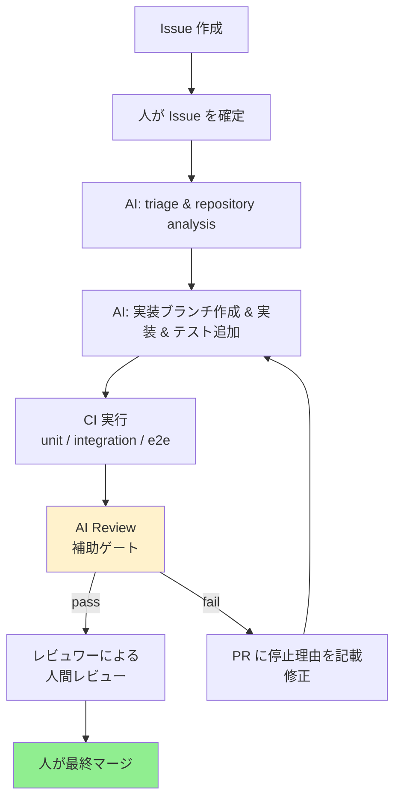

# Copilot Quality Harness 🛠️🤖

Welcome! これは「Issue 起点で AI を使った実装・テスト・PR・品質判定」のハーネスです。新人の方にも分かりやすいよう、用語・構成・運用フロー・今後の拡張案をやさしくまとめました。

---

## ざっくり 1 分説明 ⏱️
- 目的: Issue から実装→テスト→PR→品質判定までを再現可能にすること
- 方針: AI（Copilot）は「補助」役。最終判断（マージ等）は人間が行います
- 最小要素: Skills（説明書き）・Workflows（自動化）・Scripts（判定ロジック）

---

## 目次 📚
- [主要コンポーネント](#主要コンポーネント)
- [運用フロー（図）](#運用フロー図)
- [よく使うスキルとワークフロー一覧](#よく使うスキルとワークフロー一覧)
- [簡単な利用手順（試用シナリオ）](#簡単な利用手順試用シナリオ)
- [FAQ / 注意点](#faq--注意点)
- [今後の拡張案](#今後の拡張案)

---

## 主要コンポーネント 🧩
- `.github/skills/` — Skill の説明ファイル（何をするか・いつ使うか・入力/出力/停止条件などを記述）
  - 例: `ai-review-implementation.md`, `07-merge-decision.md`
- `.github/workflows/` — GitHub Actions ワークフロー（PR トリガーで AI レビューを行う等）
  - 例: `ai-review.yml`
- `scripts/` — 実行スクリプト（AI レビュー判定や差分スキャンなどの最小ロジック）
  - 例: `ai-review.mjs`, `merge-decision-check.mjs`
- `qa/` — テスト設計テンプレートや結果の保存先（将来的な格納先）

> Tip: Skill は「手順書（人／AIのどちらがやるか）」を明確にする役割です。実際の自動化は workflows と scripts が担当します。

---

## 運用フロー（図） 🌊
以下は簡易フローです。Mermaid で図示しています。

**重要**: AI Review は「補助ゲート」です。人間が最終判断（マージ）を行います。

---

## よく使うスキルとワークフロー一覧 🔎

### Skills
- `00-common-contract.md` — 全スキル共通ルール（入出力仕様、停止条件）
- `01-issue-intake-and-triage.md` — Issue の初期評価と分類
- `02-repository-analysis.md` — コード構造とテスト戦略の分析
- `03-test-observation-design.md` — テスト設計（観点・ケース）
- `04-implementation-and-test.md` — 実装とユニットテスト
- `05-test-execution-and-evidence.md` — テスト実行と証拠収集
- `06-pr-report-and-ai-review.md` — PR作成と AI Review
- `07-merge-decision.md` — マージ判定補助（自動マージは行わず）
- `08-retrospective-and-improvement.md` — 振り返りと改善
- `ai-review-implementation.md` — AI Review スクリプトの仕様

### Workflows
- `.github/workflows/ai-review.yml` — PR トリガーで AI レビューを実行
- 将来的: `.github/workflows/pr-quality.yml`（Unit/E2E/coverage 集約）

### Scripts
- `scripts/ai-review.mjs` — PR の差分・本文をチェックして JSON を返す
- `scripts/ai-review.test.mjs` — AI Review スクリプトの テストスイート
- `scripts/merge-decision-check.mjs` — マージ判定補助（停止理由の生成）
- `scripts/merge-decision-check.test.mjs` — マージ判定スクリプトのテスト

---

## 簡単な利用手順（試用シナリオ） 🧪
前提: `COPILOT_GITHUB_TOKEN` が Repository Secrets に設定されていること

1. 新しいブランチを作成して簡単な変更（README の一行追加など）を行う
2. 必要に応じて `qa/test-design.json` や `coverage` のメタ情報を PR に含める
3. ブランチを push して PR を作成する
4. Actions の `AI Review` ワークフローが自動で実行され、PR に自動コメントが追加される
5. PR コメントの `Stop reasons` を確認し、必要なら修正して再 push
6. 全て OK ならレビュワーがレビューして人がマージする

**期待**: AI Review が `pass / fail / neutral` を返し、根拠（evidence）が PR コメントに記録されます。

---

## FAQ / 注意点 ❗

**Q: AI が「承認」したら自動でマージされますか？**
- A: いいえ。ここでは自動マージは行いません。AI は補助で、最終的なマージは必ず人が行います。

**Q: Fork PR でも AI Review は動きますか？**
- A: 動きますが、fork PR はリポジトリの secret を参照できないため、安全のため一部チェックをスキップし `neutral` 扱いになります。

**Q: Secrets を直接差分に含めても検出できますか？**
- A: 簡易パターンで検出する仕組みはありますが、100% ではありません。本番では専用の secret scanning を併用してください。

---

## 今後の拡張案 🚀
- AI 評価を LLM（自然言語判定）で強化し、より詳細なレビューコメントを生成
- Coverage 等の定量評価を追加し閾値判定（例: coverage >= 80%）を自動化
- Branch protection を UI で必須化して `AI Review` を必須 Status Check に追加
- PR から運用レポートを自動集計して 2 週間ごとの振り返りを生成
- Jev 等の実行環境へ接続して判定の再現性を担保

---

## お困りのとき / 連絡先 📬
- Issues に書いてください: `Project` や `AI review` に関するフィードバックを歓迎します
- （内部向け）運用ルールや Branch protection を変更する場合は、必ず担当者に通知してください

---

この README は初心者の方が迷わないように定期的に改善します。改善アイデアや不明点があれば Issue を立ててください！ ✨

---

## Auto-merge と Branch protection

このリポジトリでは、Auto-merge を行わない方針に変更しました。
scripts/merge-decision-check.mjs は PR の安全判定と停止理由を機械的に判定する補助ツールとして残しますが、ワークフローやスクリプトから自動的に `gh pr merge --auto` を実行してマージする運用は採用しません。PR の最終マージは必ず人間が行ってください。

### 必須チェック

PR をマージする前に確認すべき必須チェック（人がマージ判断を行うための基準）は次のとおりです。

- `quality` Status Check が success
- `M2 validation` Status Check が success
- `AI Review` Status Check が success（補助判定）
- 少なくとも 1 件の human approval がある
- PR が Draft ではない
- Merge conflict がない
- fork PR ではない
- secret / permission の不足がない
- high / critical リスク変更ではない
- テストが実行済みで成功している
- diff が上限（500 行）を超えていない
- 最新コミットが base と一致している

これらはあくまで「人が最終判断する際に確認するチェック項目」です。自動マージは行わないため、上記の条件をすべて満たしていても、最終的なマージ操作は担当者が手動で実行してください。

### ブランチ保護

リポジトリ設定で `main` に対して以下を設定してください（Auto-merge は利用しない前提で、マージをヒューマンガードするための推奨設定）:

- Require pull request before merging
- Require approvals: 1
- Require status checks to pass before merging
  - `quality`
  - `M2 validation`
  - `AI Review`
- Require branches to be up to date before merging
- Dismiss stale reviews when new commits are pushed

これにより、担当者が上記の必須チェックを確認した上で手動でマージできます。
