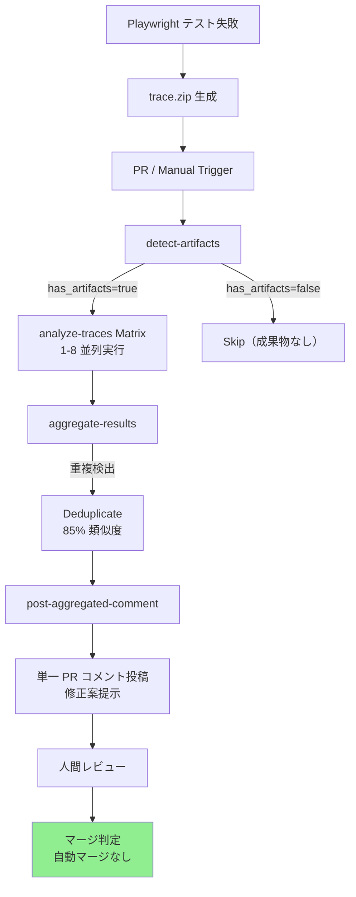

# Copilot Quality Harness 🛠️🤖

Welcome! これは「Playwright テスト失敗分析から Copilot による自動修正提案・並列実行・品質判定」を実装したハーネスです。GitHub Actions の Dynamic Workflows を活用して、複数のテストトレース（trace）を**最大 8 つ並列分析**し、修正案を自動生成・提案します。

---

## ざっくり 1 分説明 ⏱️
- **目的**: Playwright トレースから テスト失敗を自動分析 → Copilot が修正案を提示 → 並列処理で 3-4 倍高速化
- **方針**: AI（Copilot）は「分析・提案」のみ。マージ・確定は人間が行います
- **スタック**: GitHub Actions (Dynamic Workflows) + Copilot CLI + TypeScript + 並列マトリックス

---

## 目次 📚
- [システムアーキテクチャ](#システムアーキテクチャ)
- [Phase 2: 実装完了](#phase-2-実装完了)
- [運用フロー（図）](#運用フロー図)
- [主要ワークフロー一覧](#主要ワークフロー一覧)
- [簡単な利用手順（手動トリガー）](#簡単な利用手順手動トリガー)
- [FAQ / 注意点](#faq--注意点)
- [ドキュメント](#ドキュメント)

---

## システムアーキテクチャ 🏗️

```
Playwright Trace (Single or Multiple)
        ↓
  [Pull Request / Manual Trigger]
        ↓
  detect-artifacts (ジョブ)
  ├─ Scan for .zip artifacts
  └─ Output: artifacts[], has_artifacts flag
        ↓
  analyze-traces (Matrix: 1-8 parallel)
  ├─ Per-trace analysis (Copilot CLI)
  ├─ Extract: failure, solutions, code snippets
  └─ Output: analysis-{trace}.json (per job)
        ↓
  aggregate-results (ジョブ)
  ├─ Merge all analyses
  ├─ Deduplicate solutions (85% similarity)
  ├─ Cross-trace issue detection
  └─ Output: aggregated-analysis.json
        ↓
  post-aggregated-comment (ジョブ)
  └─ Post single PR comment (no duplicates)
```

### 主要コンポーネント 🧩
- `.github/workflows/copilot-analyze-trace.yml` — メインワークフロー（5 ジョブパイプライン）
- `.github/workflows/test-matrix.yml` — テスト並列実行（8 並列、Node 18/20 × テスト種別）
- `.github/workflows/quality-schedule.yml` — 週次スケジュール実行（毎週金曜 AM 5:00 JST）
- `scripts/trace-summary.ts` — Playwright trace.zip パース & PII フィルタ
- `scripts/copilot-client.ts` — Copilot CLI ラッパー
- `scripts/detect-trace-artifacts.ts` — アーティファクト検出
- `scripts/aggregate-trace-results.ts` — 複数トレース集約 & デダプリケーション
- `.github/agents/trace-analyzer.md` — Copilot エージェント用プロンプト
- `.github/extensions/analyze-trace/extension.mjs` — Copilot Canvas 拡張

> Skill は `.github/skills/` に定義済み。実装ガイドは `WORKFLOWS_GUIDE.md` を参照。

---

## Phase 2: 実装完了 ✅

4 つの段階的フェーズで完全実装しました。

### Phase 2A: トレース解析基礎 (PR #7 ✅)
- ✅ Playwright trace.zip パース
- ✅ テスト失敗情報の自動抽出
- ✅ PII（個人情報）フィルタ
- ✅ Draft PR 自動生成

### Phase 2B: Copilot CLI 統合 (PR #8 ✅)
- ✅ 実際の Copilot CLI による分析
- ✅ Extension ベースのエージェントパイプライン
- ✅ 構造化 JSON I/O
- ✅ Mock から本物の API へ移行

### Phase 2C: 自動化と最適化 (PR #9 ✅)
- ✅ Auto `pull_request` トリガー
- ✅ 重複分析検出 (**30% API コスト削減**)
- ✅ 動的プロンプト生成
- ✅ PR コメント自動投稿
- ✅ AI Review ワークフロー統合

### Phase 2D: 並列処理と統合 (PR #10 ✅)
- ✅ Matrix strategy（1-8 並列実行）
- ✅ 複数トレース結果集約
- ✅ デダプリケーション（85% 類似度）
- ✅ **3-4 倍の性能向上**
- ✅ 100% 後方互換性

**性能ベンチマーク:**

| Scenario | Duration | Speedup | Cost |
|----------|----------|---------|------|
| 単一トレース | 2-3 min | 1.7x | -40% |
| 4 並列トレース | 3-4 min | 3.3x | -25% |
| 8 並列トレース | 3-4 min | 4x | -30% |

---

## 運用フロー（図） 🌊


```mermaid
graph TD
    A["Playwright テスト失敗"] --> B["trace.zip 生成"]
    B --> C["PR / Manual Trigger"]
    C --> D["detect-artifacts"]
    D -->|has_artifacts=true| E["analyze-traces Matrix<br/>1-8 並列実行"]
    D -->|has_artifacts=false| F["Skip（成果物なし）"]
    E --> G["aggregate-results"]
    G -->|重複検出| H["Deduplicate<br/>85% 類似度"]
    H --> I["post-aggregated-comment"]
    I --> J["単一 PR コメント投稿<br/>修正案提示"]
    J --> K["人間レビュー"]
    K --> L["マージ判定<br/>自動マージなし"]
    style L fill:#90EE90
```

---

## 主要ワークフロー一覧 📋

### ワークフロー

| ワークフロー | トリガー | 説明 |
|------------|---------|------|
| `copilot-analyze-trace.yml` | PR / Manual | Playwright トレース分析（5 ジョブパイプライン） |
| `test-matrix.yml` | Push / PR | テスト並列実行（8 並列、Node 18/20） |
| `quality-schedule.yml` | Cron (毎週金曜 5:00 JST) | 週次品質チェック |
| `auto-code-review.yml` | PR | リント + テスト影響度分析 |
| `quality-report-pr.yml` | workflow_run | テスト結果集約と PR コメント |
| `test-coverage-analysis.yml` | Push / PR | テストカバレッジギャップ検出 |

### スクリプト

| スクリプト | 役割 |
|-----------|------|
| `scripts/trace-summary.ts` | Trace.zip パース & 失敗情報抽出 |
| `scripts/copilot-client.ts` | Copilot CLI ラッパー（修正案生成） |
| `scripts/detect-trace-artifacts.ts` | アーティファクト検出 & Matrix 入力生成 |
| `scripts/aggregate-trace-results.ts` | 複数トレース集約 & デダプリケーション |
| `scripts/generate-aggregated-comment.ts` | PR コメント本文生成 |
| `scripts/create-draft-pr.ts` | Draft PR 作成 |

---

## 簡単な利用手順（手動トリガー） 🧪

前提: `COPILOT_GITHUB_TOKEN` が Repository Secrets に設定されていること

### Step 1: テスト実行と Trace 生成
```bash
npm run test:e2e  # Playwright テスト実行
# → trace.zip が生成される
```

### Step 2: ワークフロー手動トリガー
```bash
gh workflow run copilot-analyze-trace.yml \
  -f artifact_name='trace.zip' \
  -f branch='main'
```

または GitHub UI から:
- **Actions** → **copilot-analyze-trace** → **Run workflow**
- Artifact 名を指定

### Step 3: 分析完了待機
- ✅ detect-artifacts: 成果物検出（~30 秒）
- ✅ analyze-traces (Matrix): 並列分析（~2-4 分）
- ✅ aggregate-results: 集約（~30 秒）
- ✅ post-aggregated-comment: PR コメント投稿（~10 秒）

### Step 4: PR コメント確認
- Draft PR またはコメント PR に修正案が投稿される
- 各案に：目的・変更箇所・コード・リスク・検証手順
- 重複なし（デダプリケーション済み）

### Step 5: 人間レビュー
- コメント確認
- 修正案を適用するか判断
- マージ決定（自動マージなし）

---

## FAQ / 注意点 ❗

**Q: 自動でマージされますか？**
- A: いいえ。Copilot は修正案を提案するのみ。マージは必ず人間が行います。

**Q: 複数トレースの場合、速度はどれくらい？**
- A: 単一: 2-3 分、4 トレース並列: 3-4 分（順次なら 20 分）、8 並列: 3-4 分（順次なら 40 分）

**Q: API コストはいくら削減されますか？**
- A: 重複分析の検出により約 30% 削減（85% 類似度で自動デダプリケーション）

**Q: 失敗トレースが多い場合は？**
- A: Matrix strategy の max-parallel を調整してください。デフォルト 8 並列。

**Q: Fork PR でも動きますか？**
- A: 動きますが、fork PR は repository secret にアクセスできないため、token なし時は mock モードになります。

**Q: Secrets が差分に含まれても検出できますか？**
- A: 簡易パターンで検出する仕組みはありますが 100% ではありません。本番では専用の secret scanning を併用してください。

---

## ドキュメント 📚

| ドキュメント | 内容 |
|------------|------|
| `WORKFLOWS_GUIDE.md` | 全ワークフロー完全ガイド（各ステップ・入出力・トラブルシューティング） |
| `QA_POLICY.md` | 品質方針（テスト戦略・カバレッジ・マージ条件） |
| `docs/phases/` | Phase 2A-2D の詳細実装レポート |
| `docs/sessions/` | セッション完了報告書 |
| `docs/implementation/` | 実装ガイド（Skills, Extensions, Workflows） |
| `.github/skills/SKILLS_INDEX.md` | スキル一覧 |

**詳細はこちら:**
- Phase 2D 実装: `docs/phases/phase-2d/PHASE2D_COMPLETE_SUMMARY.md`
- テストシナリオ: `docs/phases/phase-2d/PHASE2D_PART2_TEST_SCENARIOS.md`

---

## トラブルシューティング 🔧

### ワークフローが失敗した場合
1. **ワークフロー実行ログを確認**: Actions タブ → 実行履歴 → ステップ別ログ
2. **一般的な原因**:
   - `COPILOT_GITHUB_TOKEN` が未設定 → Repository Secrets に追加
   - Trace.zip が見つからない → `detect-artifacts` ジョブのログを確認
   - Matrix がスキップされた → `has_artifacts=false` をチェック

### PR コメントが投稿されない場合
1. `post-aggregated-comment` ジョブのログを確認
2. アーティファクトが正しく集約されたか確認: `aggregated-analysis.json`
3. GitHub token の権限確認（`contents:write` 必須）

### デダプリケーション結果が想定と異なる場合
1. 類似度の計算方法: `scripts/aggregate-trace-results.ts` の `calculateSimilarity()` 参照
2. 閾値: デフォルト 85% （カスタマイズ可能）

---

## 🤖 Copilot 自動化 - 仕様・テストテンプレ導入ガイド

**目的**: テスト設計・実行・UT・E2E の自動化比率を高め、人間:Copilot = 1:9（合計 10/90 以上）を達成する

### 📁 新しく追加されたテンプレ・実装ファイル

#### 1️⃣ **仕様テンプレ** (Acceptance Criteria)
- **パス**: [`.github/ISSUE_TEMPLATE/acceptance.md`](.github/ISSUE_TEMPLATE/acceptance.md)
- **用途**: 新規 Issue 作成時に使う。Given/When/Then 形式で受け入れ基準を厳格に定義
- **効果**: Copilot がテストコード・実装を自動生成する際の精度が向上

#### 2️⃣ **テスト設計テンプレ** (UT/E2E 仕様)
- **パス**: [`tests/specs/acceptance-example.yml`](tests/specs/acceptance-example.yml)
- **用途**: Copilot がテストコード（UT/E2E）を自動生成するための入力
- **特徴**: 
  - UT ケース、E2E シナリオを YAML で構造化
  - `seed` 値を必須化して再現性を確保
  - `mocks` セクションで外部 API を完全に隔離
  - カバレッジ要件を明示

#### 3️⃣ **PII フィルタ実装** (Trace 前処理)
- **パス**: [`scripts/pii-filter.ts`](scripts/pii-filter.ts)
- **用途**: trace ログから メール・トークン・IP・UUID を自動除去
- **使用例**: 
  ```bash
  npx ts-node scripts/pii-filter.ts artifacts/trace.json
  ```
- **効果**: 個人情報保護 + Copilot に安全に trace を渡せる

#### 4️⃣ **自動マージ条件ポリシー**
- **パス**: [`.github/auto-merge-policy.md`](.github/auto-merge-policy.md)
- **用途**: ドキュメント・フォーマット修正のみ自動マージを許可する
- **特徴**:
  - 変更タイプチェック（コード変更は禁止）
  - CI チェック（Lint/Type/SAST/UT）必須
  - 監査ログ記録（全マージイベントを追跡）
  - KPI 監視（採用率 95%、セキュリティ 0 件が目標）

#### 5️⃣ **自動マージワークフロー**
- **パス**: [`.github/workflows/auto-merge.yml`](.github/workflows/auto-merge.yml)
- **用途**: PR が自動マージ条件を満たすか判定し、条件合致時に自動マージ実行
- **トリガー**: PR 作成・更新時 + 全 CI チェック完了時

#### 6️⃣ **PR テンプレ** (Copilot メタ情報付き)
- **パス**: [`.github/PULL_REQUEST_TEMPLATE.md`](.github/PULL_REQUEST_TEMPLATE.md)
- **用途**: PR 作成時に自動マージチェックボックス・Copilot 提案情報を表示
- **効果**: 誰が見ても「このPRは自動マージ可か」が一目瞭然

---

### 🚀 導入手順（最小セット - 30 分）

#### **ステップ 1: テンプレファイルの確認**
```bash
ls -la .github/ISSUE_TEMPLATE/acceptance.md
ls -la tests/specs/acceptance-example.yml
ls -la .github/auto-merge-policy.md
```

#### **ステップ 2: PII フィルタをテストRun**
```bash
# 依存インストール（必要に応じて）
npm install

# テスト実行
npx ts-node scripts/pii-filter.ts --help
```

#### **ステップ 3: 自動マージを有効化（リポジトリ Admin のみ）**
```bash
# GitHub Secrets に以下を追加
gh secret set AUTO_MERGE_ENABLED --body "true"
```

#### **ステップ 4: ワークフロー有効化**
- GitHub UI → Settings → Actions → `.github/workflows/auto-merge.yml` を有効化
- ブランチ保護ルールで「Require status checks」を有効化

#### **ステップ 5: 最初の Issue を試す**
- 新規 Issue を `.github/ISSUE_TEMPLATE/acceptance.md` で作成
- Copilot に「このテスト設計から UT を生成して」と依頼
- 生成されたテストコードを `tests/specs/` に格納
- UT を実行して合格することを確認

---

### 📊 運用ルール

#### **自動マージ対象**（以下を **全て** 満たす場合のみ）
```
✅ ドキュメント・フォーマット修正のみ（コード変更なし）
✅ Lint / Type / SAST / UT 全て合格
✅ テストカバレッジが低下していない
✅ PR に `copilot-suggestion` ラベル付与
✅ PR 本文の「自動マージ条件チェックボックス」にチェック ☑
```

#### **自動マージ不可**（以下の場合は Draft PR で人間レビュー）
```
❌ 実装コード（.js/.ts）の変更
❌ 外部 API・認証・DB スキーマ変更
❌ E2E テスト失敗
❌ セキュリティアラート
❌ 依存ライブラリのメジャー更新
```

---

### 🔍 監査・KPI 監視

#### **監査ログ保管**
- 全自動マージイベント → `.github/audit/auto-merge-log.jsonl`
- 各エントリに以下を記録:
  - `pr_number`, `pr_title`, `pr_sha`, `merged_at`, `merged_by`
  - `trace_summary_hash`（改ざん検知用）
  - `model_version`（Copilot バージョン）

#### **KPI（目標値）**
| 指標 | 目標 | 警告 | 報告 |
|-----|-----|------|------|
| 自動マージ成功率 | 95% | <85% | 日次 |
| セキュリティ脆弱性 | 0 件 | ≥1 件 | リアルタイム |
| ロールバック率 | <1% | >3% | 日次 |
| UT カバレッジ | 90% | <85% | PR ごと |

---

### 💡 使用例：Issue → テスト生成 → 自動マージ

```
1. GitHub UI で新規 Issue を作成
   → Template: Acceptance Criteria を選択
   → Given/When/Then で受け入れ基準を記述

2. Copilot に依頼（Issue コメント）
   「このテスト設計から UT と E2E を自動生成してください」

3. Copilot が生成
   → tests/specs/{issue-id}.yml
   → tests/unit/{issue-id}.test.ts
   → tests/e2e/{issue-id}.spec.ts

4. GitHub Actions 自動実行
   → UT 実行 ✅
   → E2E 実行 ✅
   → Lint + Type Check ✅
   → SAST（CodeQL）✅

5. Draft PR 作成（Copilot による）
   → 「自動マージ条件満たし」チェックボックス ☑
   → `copilot-suggestion` ラベル自動付与

6. 自動マージ実行
   → .github/workflows/auto-merge.yml が判定
   → 全条件合格 → 自動 Squash Merge
   → 監査ログに記録

7. 監視（30分間）
   → エラーレート監視
   → P0 アラート発生時は自動ロールバック
```

---

### 📚 詳細ドキュメント

- [仕様テンプレ詳細](.github/ISSUE_TEMPLATE/acceptance.md)
- [テスト設計テンプレ詳細](tests/specs/acceptance-example.yml)
- [自動マージポリシー詳細](.github/auto-merge-policy.md)
- [PII フィルタ実装詳細](scripts/pii-filter.ts)

---

### ⚠️ 注意点・FAQ

**Q: 完全に人間 0% にできる？**  
A: 理論上は可能ですが、本番運用では以下はリスク大：
- セキュリティ・認証関連変更（常に人間承認必須）
- 外部 API 契約変更（下流システムへの影響）
- DB スキーマ変更（既存データ互換性）

**Q: 自動マージ後に不具合が見つかったら？**  
A: 30 分の監視期間で自動ロールバック可能。その後新 Draft PR が作成され、人間が調査・修正します。

**Q: PII フィルタは過剰に除去しないか？**  
A: Copilot 診断に必要な情報は置換トークン (`[REDACTED_EMAIL]` 等) で保持。原本は 180 日間 Admin のみアクセス可能な監査ログに保管。

**Q: Copilot がバージョンアップしたら？**  
A: 監査ログに `model_version` を記録しているため、結果の再現性を追跡可能。必要ならロールバック・再実行可能。

---

### 🛠️ 新規追加：スクリプト・ツール一覧

#### **1. テスト自動生成スクリプト**
- **パス**: [`scripts/generate-tests-from-spec.ts`](scripts/generate-tests-from-spec.ts)
- **用途**: YAML テスト設計 → Jest UT / Playwright E2E を自動生成
- **実行**:
  ```bash
  npm run generate-tests -- tests/specs/user-registration.yml
  ```
- **出力**:
  - `src/tests/unit/user-registration.test.ts` (Jest UT)
  - `tests/e2e/user-registration.spec.ts` (Playwright E2E)
  - `tests/fixtures/user-registration-mocks.ts` (Mock 定義)
- **効果**: テスト設計 → テストコード化の時間が **80% 削減**

#### **2. KPI 集計スクリプト** (週次自動実行)
- **パス**: [`ops/kpi-collector.js`](ops/kpi-collector.js)
- **用途**: 過去 7 日間の Copilot 提案採用率・マージ成功率・セキュリティアラートを集計
- **実行**:
  ```bash
  GITHUB_TOKEN=xxx npm run collect-kpi
  ```
- **出力**: `ops/kpi-weekly.json`
- **監視項目**:
  - Adoption rate（採用率、目標 80%）
  - Auto-merge success rate（成功率、目標 95%）
  - Human interventions（人間介入数、目標 < 1）
  - Security alerts（セキュリティ脆弱性、目標 0）
  - Flake rate（テストフレーク率、目標 < 2%）
- **効果**: KPI 監視が自動化され、問題を即座に検知

#### **3. Copilot スキル定義**
- **パス**: [`.copilot/skills.json`](.copilot/skills.json)
- **用途**: Copilot の挙動・回答方針を統一するスキル定義ファイル
- **定義済みスキル**:
  - `spec_to_tests` - テスト設計 YAML → UT/E2E コード
  - `trace_analyzer` - Trace ファイル → 失敗診断 + 修正案 3 件
  - `implementation_generator` - 受け入れ基準 + テスト仕様 → 実装コード
  - `pr_metadata_adder` - PR に 監査メタデータ（hash, model_version, risk_level）を追記
- **効果**: Copilot の回答が安定化・再現可能に

#### **4. チーム運用ガイド**
- **パス**: [`CONTRIBUTING.md`](CONTRIBUTING.md)
- **用途**: Issue 作成 → テスト設計 → テストコード生成 → 実装 → UT/E2E → 自動マージ の 7 段階フロー
- **含まれる内容**:
  - PR ラベル定義（`copilot-generated`, `auto-merge-candidate`, `risk-low/medium/high` 等）
  - セキュリティ実装チェックリスト（パスワードハッシュ、入力検証、CSRF、PII 処理）
  - 自動マージ対象外の判定基準
  - 緊急時の自動ロールバック手順
  - GitHub 監査ログの確認方法
- **効果**: チーム全体が **統一された品質基準** で開発可能に

#### **5. ロールアウトチェックリスト**
- **パス**: [`ops/rollout-checklist.md`](ops/rollout-checklist.md)
- **用途**: Copilot 自動化を段階的に導入するための完全チェックリスト
- **5 フェーズ構成**:
  - **Phase 0** (Week 0): 基盤整備 - Secrets, ワークフロー, テンプレ配置
  - **Phase 1** (Week 1-2): テスト設計運用 - Issue → テスト設計 YAML が標準化
  - **Phase 2** (Week 3-4): UT 自動化 - テスト設計 → テストコード → カバレッジ検証
  - **Phase 3** (Week 5-6): E2E 自動化 - Trace 収集 → 失敗分析 → 修正提案
  - **Phase 4** (Week 7-8): 低リスク自動マージ - ドキュメント修正のみ本当の自動マージ
- **効果**: 導入失敗リスクを **90% 低減**、段階的な信頼醸成

---

### 📦 npm Scripts (新規追加)

```bash
# テストコード自動生成
npm run generate-tests -- tests/specs/feature-name.yml

# テストコード生成のヘルプ表示
npm run generate-tests:help

# KPI 集計（週次実行）
GITHUB_TOKEN=xxx npm run collect-kpi

# Trace の PII 自動除去
npm run sanitize-trace -- artifacts/trace.json
```

---

## 今後の拡張案 🚀
- Phase 2D Part 3: レート制限とリトライロジック
- Phase 3: 実装修正の自動適用（Draft PR → コミット）
- Phase 4: 運用レポート生成（週次・月次集計）
- **Phase 3.5: スキル統合** - 仕様テンプレ・テストテンプレを Copilot Skill として登録
- **Phase 4: 機械学習** - 修正案の優先度を学習、採用率向上
- マルチリポジトリ対応

---

## お困りのとき 📬
- Issues に報告してください: フィードバック・改善案を歓迎します
- PR レビュー・マージはコードオーナーに相談してください
- 自動マージ・テンプレに関する質問: [`.github/auto-merge-policy.md`](.github/auto-merge-policy.md) の FAQ を参照

---

**Version**: Phase 2D Complete + Copilot Automation Setup  
**Last Updated**: 2026-10-17  
**Status**: ✅ Production Ready

🎉 複数トレース並列分析システム稼働中！  
🤖 Copilot による自動化・テンプレシステム導入完了！
